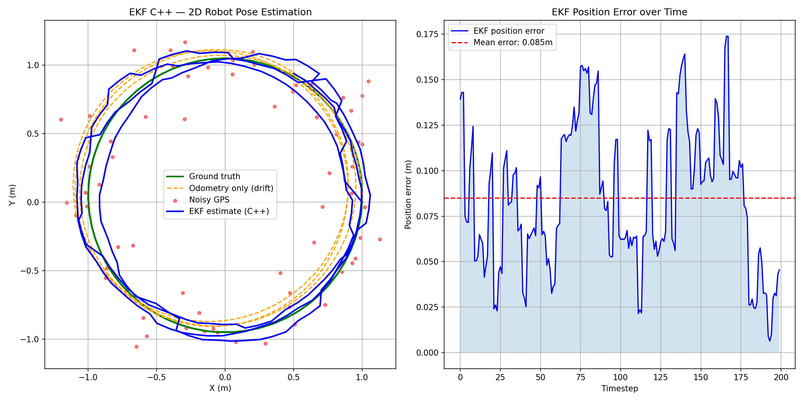

# Extended Kalman Filter , 2D Robot Pose Estimation (C++)

## Overview

C++ implementation of an Extended Kalman Filter (EKF) for real-time pose 
estimation of a 2D mobile robot. The filter fuses noisy odometry and GPS-like 
measurements to accurately estimate the robot's position and orientation over time.

Implemented in C++ with Eigen for matrix operations , the same stack used in 
embedded robotics and real-time control systems.

A Python visualization script is provided to plot the results.

## Problem

A robot moves along a circular trajectory. In practice:
- **Odometry** accumulates drift over time due to noise
- **GPS measurements** are available but noisy and infrequent (every 3 steps)

The EKF fuses both sources optimally, maintaining an estimate of the robot 
state [x, y, θ] and its uncertainty (covariance matrix P).

## Theory

### State vector

x = [x, y, θ]  , position (m) and heading (rad)

### Non-linear motion model

x_k+1 = f(x_k, u_k) + noise

f(x, u) :
  x     += v * cos(θ) * dt
  y     += v * sin(θ) * dt
  θ     += ω * dt

Linearized at each step via the Jacobian F:

F = | 1  0  -v*sin(θ)*dt |
    | 0  1   v*cos(θ)*dt |
    | 0  0   1           |

### Measurement model

GPS provides noisy [x, y] observations:
z_k = H * x_k + noise

H = | 1  0  0 |
    | 0  1  0 |

### Filter steps

1. Predict  , x = f(x, u),  P = F*P*F' + Q
2. Update   , Kalman gain K, correct x and P using GPS measurement

### References

- Thrun, S., Burgard, W., Fox, D. (2005). Probabilistic Robotics. MIT Press.
- Welch, G., Bishop, G. (1995). An Introduction to the Kalman Filter. UNC Chapel Hill.

## Results



- 🟢 **Ground truth** , true circular trajectory
- 🟠 **Odometry only** , drifts away from true trajectory over time
- 🔴 **Noisy GPS** , sparse measurements (σ = 0.15m, every 3 steps)
- 🔵 **EKF estimate (C++)** , closely follows ground truth despite noise

Mean position error: ~0.085m

The EKF successfully corrects odometry drift using sparse GPS measurements,
demonstrating real-time state estimation in C++.

## Project Structure

```
EKF-State-Estimation-Cpp/
├── include/
│   └── ekf.h          # EKF class definition
├── src/
│   ├── ekf.cpp        # EKF implementation , predict and update
│   └── main.cpp       # simulation loop, CSV export, launches plot
├── results/
│   └── ekf_cpp_result.png
├── plot.py            # Python visualization script
└── CMakeLists.txt
```

## Dependencies & Setup

### Linux (Ubuntu)

sudo apt install g++ cmake libeigen3-dev

### macOS

brew install cmake eigen

### Windows

Option 1 , WSL2 (recommended):
https://docs.microsoft.com/en-us/windows/wsl/install
Then follow Linux instructions.

Option 2 , Native:
- CMake : https://cmake.org/download/
- Eigen  : https://eigen.tuxfamily.org/
- MinGW  : https://www.mingw-w64.org/

Python visualization (all platforms):
pip install numpy matplotlib

## Build & Run

### Linux/macOS

mkdir build && cd build
cmake ..
make
cd ..
./build/ekf_estimation

### Windows (WSL2)

Same as Linux.

### Windows (Native)

mkdir build && cd build
cmake .. -G "MinGW Makefiles"
mingw32-make
cd ..
./build/ekf_estimation.exe

### Notes

- C++17 required
- Eigen 3.3+ required
- Python 3.8+ for visualization
- Tested on Linux (Ubuntu 22.04)

## Relevance to Legged Robotics

In an exoskeleton or bipedal robot, state estimation is critical - the
controller needs to know the full body state (position, velocity, orientation
of each segment) at every timestep. The EKF, or variants like UKF and ESKF,
fuses IMU and joint encoder data in real time to provide this estimate.
This C++ implementation reflects the embedded, real-time nature of that problem.

## Author

Meriam Yanelle Ghezloun , Robotics Engineer
LinkedIn: https://www.linkedin.com/in/yanelle-ghezloun/
GitHub: https://github.com/yanelle-ghezloun
